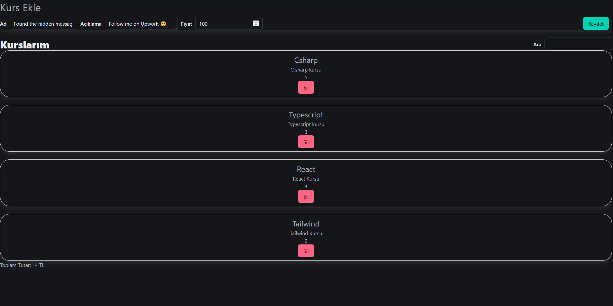

# 🧰 React Toolkit Prototype — Basic State Management • (Archived)

 

## 📌 Project Overview

This project is a **React + Redux Toolkit prototype** created to practice **basic state management** and application structure using modern Redux patterns.  
It includes functionality for adding and removing items, reducer functions for state updates, and a simple search feature — all built with Redux Toolkit best practices.  
> 📦 **Archived** — This project is no longer being updated. It’s kept as part of my learning history and serves as a technical reference for future projects.

 

## 🖼️ Screenshots
Shown below in order:  
**1. Fields**

  
  
  

 

## 🧰 Tech Stack

  
  
  

 

## 📜 License
This project is licensed under the [MIT License](./LICENSE).

---

© 2025 Yusuf Okan Sirkeci — [Hereetria](https://github.com/Hereetria)
